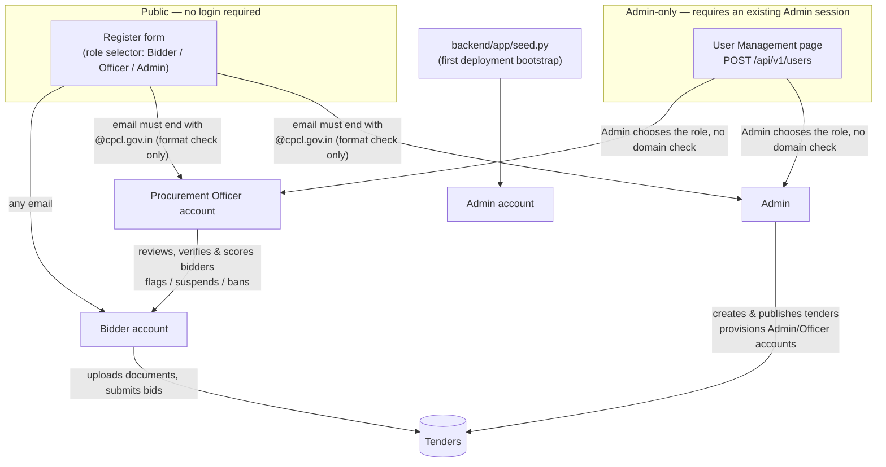

# AI-Powered Integrated Bid Compliance Verification Platform for GeM Procurement

**Smart India Hackathon — Problem Statement PS 26100**
Ministry of Petroleum & Natural Gas / Chennai Petroleum Corporation Limited (CPCL)

A decision-support prototype that helps Procurement Officers verify bidder compliance on GeM tenders faster and more consistently — combining document verification, cross-document consistency checks, explainable AI scoring, digital document forensics, behavioral risk intelligence, and a full human-in-the-loop review workflow.

> **This is a hackathon prototype.** It does not connect to any real government database or the real GeM platform. Every "government verification" in this system is served by a **Mock Government Verification API Gateway** that simulates 13 registries with clearly fictional data. Every response from that gateway is tagged `"source": "MOCK_GOVERNMENT_API"` and `"is_mock": true`. AI output in this platform is decision-support only — it never issues a final qualification, disqualification, or fraud determination. That responsibility always rests with a human Procurement Officer.

---

## 1. The problem

Procurement Officers evaluating GeM bids today manually cross-reference dozens of documents (GST, PAN, Udyam, MCA, EPFO/ESIC, OEM authorizations, local-content declarations, and more) against multiple government registries, check for internal consistency across those documents, and judge document authenticity and bidder risk — all largely by hand. This is slow, inconsistent between officers, and easy to game with subtly inconsistent paperwork.

## 2. The solution

This platform automates the mechanical parts of that process end-to-end — document intake and OCR, mock government verification, cross-document consistency checking, and explainable compliance scoring — and augments it with ten additional "USP" intelligence layers described below, while keeping every consequential decision in the hands of a human officer.

## 3. Tech stack

**Backend:** Python, FastAPI, SQLAlchemy 2.0 (ORM, PostgreSQL-compatible architecture running on SQLite for the prototype), Pydantic v2, JWT auth (python-jose) with bcrypt password hashing, scikit-learn (TF-IDF + cosine similarity for document comparison), pypdf (real OCR/text extraction from uploaded PDFs), pytest.

**Frontend:** React 19 + TypeScript, Vite, Tailwind CSS v4, React Router, Axios, React Hook Form + Zod, Recharts, lucide-react icons, Vitest + React Testing Library.

**AI:** A fully deterministic, rule-based `MockAIProvider` (no external LLM calls, no API keys required) generates every score, recommendation, and copilot answer from evidence already computed by the platform. The provider is swappable — an `LLMProvider` interface exists behind the same `AIProvider` abstraction and can be enabled via the `AI_PROVIDER` environment variable without touching any calling code.

## 4. Architecture

### 4.1 Role structure & account provisioning

The platform has three roles with a strict, one-directional privilege order — **Admin → Procurement Officer → Bidder**.

> **Demo-only registration rule.** For ease of demoing, an Admin or Procurement Officer account can be created through the *same* public Create Account / Register form a Bidder uses — the only gate is that the email address must end with a configured domain (`cpcl.gov.in` by default), checked as a plain string suffix. It does **not** verify mailbox ownership, send a verification email, require an OTP, or check DNS/MX records — see `settings.PRIVILEGED_ROLE_EMAIL_DOMAIN` in `backend/app/core/config.py` (one environment variable, `PRIVILEGED_ROLE_EMAIL_DOMAIN`, so the domain — or the rule itself — can be changed without touching auth logic). This intentionally trades off strict RBAC-at-registration for a demo that any judge can click through end-to-end without needing a real government mailbox. An existing Admin can still separately provision Admin/Officer accounts with no domain restriction at all via the in-app **User Management** page (`POST /api/v1/users`), which is unchanged and is the right mechanism for a real deployment where this domain shortcut is removed.



Sign In and Registration are two different forms on the login page. Registration lets the user pick Bidder, Procurement Officer, or Admin; picking Officer or Admin requires (and the UI validates, with the message "Admin and Procurement Officer accounts require an `@cpcl.gov.in` email address") an email on the configured domain, while Bidder has no restriction. The backend is the actual source of truth and re-validates on every request regardless of what the UI allowed through (`POST /api/v1/auth/register`, `app/api/v1/auth.py`) — a crafted API request with a non-`cpcl.gov.in` email and `role: ADMIN` gets a `422` and no account is created. Sign In authenticates whatever account already exists — self-registered or seeded — with the role loaded from the database and encoded into the JWT, exactly as before. `GET /api/v1/auth/config` exposes the configured domain so the frontend never hardcodes it.

Admin and Procurement Officer are deliberately different jobs, not tiers of the same job, regardless of how the account was created: the Admin owns tender creation/publishing and account provisioning; the Officer owns document/compliance review and bidder moderation (flag / suspend / permanently ban) but can neither create tenders nor create Bidder accounts. A permanently banned Bidder is blocked immediately — their `User.is_active` flag is flipped the moment the ban is recorded, so even an already-issued JWT stops working on its very next request, not just at the next login — and every moderation action is written to the audit trail.

### 4.2 End-to-end tender → document → review flow

```mermaid
sequenceDiagram
    actor Admin
    actor Bidder
    actor Officer

    Admin->>Backend: Create & publish tender (OPEN_TENDER or invite-only)
    Note over Backend: OPEN_TENDER is auto-discoverable;<br/>LIMITED/SINGLE_TENDER needs an explicit invite
    Bidder->>Backend: GET /api/v1/portal/tenders
    Backend-->>Bidder: Eligible tenders (is_tender_visible)
    Bidder->>Backend: Open tender / upload document
    Note over Backend: ensure_enrolled() lazily links the Bidder<br/>to the tender on first genuine engagement
    Backend-->>Officer: Bidder now appears under the tender's<br/>bidder list and document review queue
    Officer->>Backend: Review documents, run verification & scoring
    Officer->>Backend: Record QUALIFIED / DISQUALIFIED / PENDING_REVIEW
    Bidder->>Backend: Submit bid
    Bidder->>Backend: Download compliance report / bid receipt (PDF)
```

### 4.3 Codebase layout

```
gem-compliance-platform/
├── backend/            FastAPI application
│   ├── app/
│   │   ├── api/v1/         REST endpoints, grouped by feature
│   │   ├── core/           config, database, security, RBAC dependencies
│   │   ├── models/         SQLAlchemy ORM models (17 entities)
│   │   ├── schemas/        Pydantic request/response schemas
│   │   ├── providers/
│   │   │   ├── government/     13 mock registry providers + facade
│   │   │   ├── document/       Mock + Local OCR document extraction providers
│   │   │   └── ai/             MockAIProvider / LLMProvider behind a common interface
│   │   ├── engines/        Core verification & intelligence logic (see below)
│   │   ├── services/       Orchestration, audit logging, dashboards
│   │   └── seed.py         Deterministic demo data generator
│   └── tests/           86 pytest tests across auth, RBAC (incl. the demo email-domain
│                         registration rule and bidder-moderation lockout), documents,
│                         verification, compliance, forensics, behavior, simulator,
│                         decisions, audit, tender-discovery/eligibility, and Admin
│                         user provisioning
├── frontend/            React + TypeScript SPA
│   └── src/
│       ├── api/             Typed API client modules, one per backend feature area
│       ├── components/      Reusable domain + UI components
│       ├── pages/           Route-level pages
│       ├── context/         Auth context
│       └── router/          Route table with role-aware navigation
├── data/                Placeholder for sample/fixture data
├── docs/                API.md — endpoint reference
└── docker-compose.yml   One-command local deployment
```

### Engines (the platform's core logic)

| Engine | Responsibility |
|---|---|
| `cross_check_engine` | Compares extracted fields across a bidder's documents and profile (PAN↔GST embedding, name/address consistency, turnover, dates, OEM authorization) and raises `Discrepancy` records. |
| `compliance_engine` | Evaluates every tender requirement against the bidder's evidence and produces an explainable `ComplianceReport` with a 0–100 score and LOW/MEDIUM/HIGH risk band. |
| `forensics_engine` | Digital Document Forensics (USP 1) — real signals (cross-bidder identical file reuse via SHA-256, suspiciously small files, low OCR confidence) plus deterministic simulated structural/metadata heuristics. Never claims a document is fake. |
| `fingerprint_engine` | Document DNA/Fingerprinting (USP 2) — TF-IDF + cosine similarity comparison of document content and structure, within and across bidders. |
| `behavioral_engine` | Behavioral Risk Intelligence (USP 3) — submission timing, cross-bidder document/address/director/pricing similarity, company lifecycle, and historical patterns. Every flag requires human review. |
| `cross_bidder_graph_engine` | Cross-Bidder Intelligence Graph (USP 4) — a node/edge relationship graph per tender. |
| `red_flag_cascade` | Red Flag Cascade (USP 5) — chains each discrepancy from raw evidence through to a recommended officer action. |
| `simulator_engine` | What-If Compliance Simulator (USP 6) — pure in-memory recompute of every bidder's score under hypothetical requirement changes; never writes to the real tender. |

Layered on top: an **Exception-Only Procurement** review queue (USP 7) that surfaces only bidders needing attention, a **Procurement Officer Copilot** (USP 8) that answers questions strictly from evidence already computed by the platform, a full **Audit Time Machine** (USP 9) recording every action, and a **Bidder 360°** investigation view (USP 10) that brings all of the above together for one bidder on one tender.

## 5. Features

### Mandatory (PS-required) layer
- Role-based access control: BIDDER, PROCUREMENT_OFFICER, ADMIN, with Admin/Officer duties clearly separated (§4.1); public self-registration for Admin/Officer is gated by a demo-only, centrally-configured email-domain check (§4.1) — Bidder registration is unrestricted
- Bidder profile & tender/requirement management
- Document upload, OCR/field extraction, and verification against the Mock Government Verification API Gateway (13 simulated registries: GST, PAN, Udyam, Income Tax, MCA, Startup India, NSIC, EPFO, ESIC, OEM Authorization, Local Content, Debarment, DigiLocker)
- In-browser document preview and downloadable compliance-report / bid-receipt PDFs
- Bidder moderation — flag / suspend / permanently ban, enforced immediately and audit-logged
- Login rate limiting (fixed-window lockout after repeated failures) as basic brute-force protection
- Cross-document consistency checking
- Explainable compliance scoring (every point traces to a concrete piece of evidence)
- AI recommendation restricted to `COMPLIANT` / `REQUIRES_REVIEW` / `NON_COMPLIANT` — never a final verdict
- Procurement Officer dashboard, human-in-the-loop final decision (`QUALIFIED` / `DISQUALIFIED` / `PENDING_REVIEW`)
- Complete, append-only audit trail

### USP / innovation layer
1. Digital Document Forensics — non-accusatory anomaly signals only
2. Document DNA / Fingerprinting
3. Behavioral Risk Intelligence
4. Cross-Bidder Intelligence Graph
5. Red Flag Cascade (evidence → anomaly → requirement → score impact → risk → recommendation → action)
6. What-If Compliance Simulator (never mutates real tender data)
7. Exception-Only Procurement review queue
8. Procurement Officer Copilot (evidence-grounded, zero hallucination by construction — it only templates over data already computed)
9. Compliance Timeline / Audit Time Machine
10. Bidder 360° investigation view

## 6. Guardrails (by design, not by prompt)

- The Mock Government Verification API Gateway is structurally incapable of claiming to be a real integration: every provider response is wrapped in an envelope carrying `source: "MOCK_GOVERNMENT_API"` and `is_mock: true`.
- `MockAIProvider.build_recommendation()` can only return one of `COMPLIANT`, `REQUIRES_REVIEW`, `NON_COMPLIANT` — the type system and the calling code have no path to a "fraud" or "guilty" verdict.
- Every AI recommendation carries a `disclaimer` field stating it is decision-support only.
- Forensic and behavioral engines are hard-coded to phrase findings as "potential anomaly, manual verification recommended" — never an accusation.
- The final qualification decision is a separate, human-authored `OfficerDecision` record — the AI recommendation and the officer decision are stored independently, and the UI presents both side by side rather than treating the AI output as an outcome.

## 7. Getting started

Want a public URL instead (e.g. for judges)? See [`docs/DEPLOYMENT.md`](docs/DEPLOYMENT.md) — Netlify only serves static files, so the backend needs a separate host (Render/Railway/Fly.io all work with the included Dockerfile).

### Option A — Docker (recommended for a quick demo)

```bash
docker compose up --build
```

- Backend: http://localhost:8000 (interactive API docs at `/docs`)
- Frontend: http://localhost:8080

Then seed demo data (first run only):

```bash
docker compose exec backend python -m app.seed
```

### Option B — Local development

**Backend**

```bash
cd backend
python3 -m venv venv
source venv/bin/activate
pip install -r requirements.txt
cp .env.example .env
python -m app.seed        # creates tables and loads demo data
uvicorn app.main:app --reload --port 8000
```

**Frontend**

```bash
cd frontend
npm install
cp .env.example .env
npm run dev
```

Open http://localhost:5173.

### Running the backend test suite

```bash
cd backend
source venv/bin/activate
python -m pytest -q
```

86 tests cover authentication & RBAC (including the demo email-domain registration rule for Admin/Officer self-registration and immediate bidder-ban lockout), Admin user provisioning, bidder/tender/requirement management, tender discovery & eligibility, document upload & OCR, mock government verification, cross-document mismatch detection, compliance scoring & AI recommendation, digital forensics & fingerprinting, behavioral risk analysis, the What-If simulator, officer decisions, and the audit trail.

### Running the frontend test suite

```bash
cd frontend
npm install
npm run test        # vitest, single run
npm run build       # tsc -b (type check) + vite build
npm run lint        # oxlint
```

Vitest + React Testing Library cover formatting/utility helpers, the `apiErrorMessage` API-error normalizer, and — most importantly for this platform — the `RoleRoute` guard that enforces the Admin/Procurement Officer/Bidder permission boundaries in the UI (a role outside a route's allow-list is redirected, never shown the page).

## 8. Demo credentials

| Role | Email | Password |
|---|---|---|
| Admin | `admin@cpcl.gov.in` | `Admin@123` |
| Procurement Officer | `officer@cpcl.gov.in` | `Officer@123` |
| Bidder | `bidder@example.com` | `Bidder@123` |

All three sign in from the same **Sign In** form. To create more accounts for testing, use the **Create account** form (public, no login required): pick Bidder for no restriction, or Procurement Officer/Admin with any email ending in `@cpcl.gov.in` (e.g. `rahul@cpcl.gov.in`) — see §4.1 for why that's safe for a demo but is explicitly not real domain verification. Admin/Officer accounts can also be provisioned by an existing Admin from **User Management** in the sidebar, with no domain restriction.

`python -m app.seed` creates 3 fictional tenders and 10 fictional bidders with deliberately varied scenarios (clean bidders, expired documents, PAN/GST mismatches, byte-identical cross-bidder file reuse, overlapping directors, forced debarment, etc.), so every USP module has something real to show.

### Suggested demo walkthrough

1. Sign in as the Procurement Officer.
2. **Dashboard** — platform-wide risk distribution and the top of the review queue.
3. **Tenders → Supply and Installation of Process Instrumentation & Control Valves** — see all bidders on the tender, including the showcase bidder **Alpha Energy Solutions Pvt Ltd**.
4. Open Alpha Energy Solutions' **Bidder 360°** view and walk through its tabs: compliance score and requirement-level evidence, mock government verification results, cross-document discrepancies (a minor legal-name variation and an MCA/incorporation date mismatch), forensics (a byte-identical OEM authorization letter shared with another bidder), behavioral flags, the Red Flag Cascade, the AI recommendation (`NON_COMPLIANT`, with reasons), and finally the officer decision panel.
5. **Cross-Bidder Intelligence** — view the relationship graph for the same tender.
6. **What-If Simulator** — try lowering the local-content threshold and watch every bidder's simulated score and rank recompute live, with a confirmation that the real tender is untouched.
7. **Audit Trail** — see the complete, timestamped history of every action taken.

## 9. Limitations & future scope

- Persistence uses SQLite for the prototype; the ORM layer is written against SQLAlchemy 2.0 with no SQLite-specific features, so switching `DATABASE_URL` to a PostgreSQL connection string is the only change needed for a production-grade database.
- Document extraction uses simple regex-based OCR for real PDFs/text files, falling back to a deterministic mock extractor; a production system would integrate a real OCR/IDP service.
- `MockAIProvider` is intentionally deterministic and rule-based for reproducible demos; the `AI_PROVIDER=llm` path is scaffolded (`app/providers/ai/llm_provider.py`) for a future real-LLM integration behind the same interface.
- Real government API integration (GSTN, Udyam, MCA21, DigiLocker, etc.) would replace the mock provider layer without any change to calling code, by design.
- In-app notifications (with a polled unread badge in the Bidder sidebar) are implemented; a push/email channel, multi-language support, and a full digital-signature/DSC verification flow remain out of scope for this prototype.
- Login rate limiting uses an in-memory, single-instance limiter — sufficient for this deployment; a multi-instance production deployment would move it to a shared store such as Redis.
- The demo email-domain rule for self-registering Admin/Officer accounts (§4.1) is a deliberate, documented weakening of RBAC-at-registration for ease of demoing, not a real identity check. A production deployment should remove the ADMIN/PROCUREMENT_OFFICER options from the public Register form entirely (or replace the domain check with real SSO/government-issued-identity verification) and provision those accounts exclusively via the Admin-only User Management page.

---

See [`docs/API.md`](docs/API.md) for the full REST API reference.
